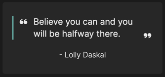

# A quote of the day tile for the Laravel Dashboard

[](https://packagist.org/packages/roelgonzalez/:package_name)
[](https://packagist.org/packages/roelgonzalez/:package_name)

This tile displays a quote of the day on your dashboard.

This tile can be used on [the Laravel Dashboard](https://docs.spatie.be/laravel-dashboard).

<p align="center"></p>

## Installation

You can install the package via composer:

```bash
composer require roelgonzalez/laravel-dashboard-quote-of-the-day-tile
```

## Usage

In your dashboard view you use the `livewire:quote-of-the-day-tile` component.

```html
<x-dashboard>
    <livewire:quote-of-the-day-tile position="a1" />
</x-dashboard>
```

## Changelog

Please see [CHANGELOG](CHANGELOG.md) for more information on what has changed recently.

## Contributing

Please see [CONTRIBUTING](https://github.com/spatie/.github/blob/main/CONTRIBUTING.md) for details.

## Credits

- [Roël Gonzalez](https://github.com/roelgonzalez)
- [All Contributors](../../contributors)

## License

The MIT License (MIT). Please see [License File](LICENSE.md) for more information.
